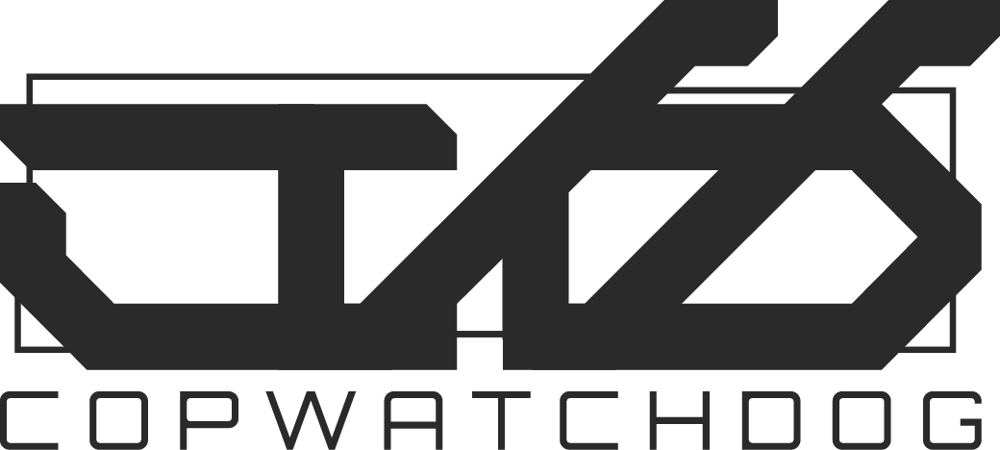

## Repository Structure & Branch Conventions

- **COPWATCHDOG** (meta repository): `master` branch [private]
- **HERMES**: `main` branch [private]
- **THOTH**: `main` branch
- **MERCURY**: `main` branch [private]
- **DOGHOUSE_API**: `main` branch [private]

All repositories are under the [COPWATCHDOG GitHub organization](https://github.com/copwatchdog).

---

# THOTH - Data Collection Engine

---

## Organizational & Contributor Info

- **COPWATCHDOG** is the GitHub organization: [github.com/copwatchdog](https://github.com/copwatchdog)
- **YUMYODA** is the initiative/account: [github.com/YUMYODA](https://github.com/YUMYODA)
- **Stizzi** ([github.com/Stizzi](https://github.com/Stizzi)) is the co-founder of YUMYODA and initiator of COPWATCHDOG.

All repositories (including THOTH) are under the COPWATCHDOG GitHub organization.

---




**Version:** v110 (November 2025)  
**Component:** THOTH (Data Collection)  
**Purpose:** Automated web scraping of NYPD trial schedules, enriched with 50-a.org complaints and NYC Payroll data

---

## About

THOTH is the data collection engine for the COPWATCHDOG project. It scrapes NYPD officer trial data and enriches it with complaint histories, lawsuit information, and payroll data from public sources.

**Named after:** Thoth, the Egyptian god of knowledge and writing.

---

## How THOTH Works

### Data Sources

1. **NYPD Trials Page** - Officer trial schedules (Date, Time, Rank, Name, Room, Case Type)
2. **50-a.org** - Officer profiles with complaints, lawsuits, settlements, demographics, and assignment history
3. **NYC Open Data Payroll** - Salary, overtime, and compensation data

### Scraping Process

1. **Trial Schedule Extraction**
   - Opens NYPD trials webpage using Playwright (headless Chrome)
   - Identifies relevant tables using keyword scoring algorithm
   - Extracts officer names, ranks, trial dates, room numbers, case types

2. **50-a.org Enrichment**
   - Searches 50-a.org for each officer by name
   - Extracts complaint statistics, lawsuit data, demographics
   - Parses assignment history into current/previous assignments

3. **NYC Payroll Enrichment**
   - Queries NYC Open Data for officer salary information
   - Matches by name and service start date
   - Extracts base salary, overtime, pay basis

4. **CSV Output**
   - Generates monthly CSV file: `YYMM-copwatchdog.csv` (e.g., `2511-copwatchdog.csv`)
   - Creates companion `articles.csv` if news articles found
   - Stores in `NYC/CSV/` directory with local `copwatchdog.csv` copy

---

## Project Structure

```tree
THOTH/
├── NYC/
│   ├── BRAIN/
│   │   ├── main.py              # Main scraper script (v110)
│   │   ├── copwatchdog.csv      # Latest scraped data (working copy)
│   │   └── __pycache__/         # Python cache
│   └── CSV/
│       ├── 2509-copwatchdog.csv # September 2025 data (15 officers)
│       ├── 2510-copwatchdog.csv # October 2025 data (28 officers)
│       ├── 2511-copwatchdog.csv # November 2025 data (19 officers)
│       ├── articles.csv         # Officer-related news articles (12 articles)
│       └── delta_rescrape_*.csv # Delta detection lists (5 columns)
├── assets/
│   └── images/
│       ├── logo-dark.png        # Logo (dark background)
│       └── logo-light.png       # Logo (light background)
├── LOGS/                        # Scraping logs directory
├── LICENSE                      # CopWatchDog Community License 1.0
└── README_THOTH.md             # This file
```

---

## Usage

### Standalone Mode (Full Scrape)

```bash
cd /Users/vicstizzi/ART/YUMYODA/TECH/COPWATCHDOG/THOTH/NYC/BRAIN
python3 main.py
```

**Output:**

- `../CSV/YYMM-copwatchdog.csv` - Monthly CSV with current version tag
- `copwatchdog.csv` - Local working copy
- `articles.csv` - News articles (if any officers have articles='Y')

**CSV Format:** 37 columns (v110 format)

### Rescrape Mode (HERMES Integration)

```bash
python3 main.py --rescrape-list ../../CSV/delta_rescrape_2511.csv --version-tag 2511
```

**Purpose:** Update specific officers identified by HERMES delta detection

**Input:** 5-column CSV (source_id, first_name, last_name, version_tag, reason)

**Output:** Updates existing monthly CSV with new data, merges with existing records

**Behavior:**

- Appends to log (doesn't overwrite)
- Merges data into existing monthly CSV
- Only updates NULL or incomplete fields

---

## CSV Output Format

### v110 Format (37 Columns) - Current

| Column | Source | Description |
|--------|--------|-------------|
| Date | NYPD Trials | Trial date (MM/DD/YYYY) |
| Time | NYPD Trials | Trial time (HH:MM AM/PM) |
| Rank | NYPD Trials | Officer rank |
| First | NYPD Trials | First name |
| Last | NYPD Trials | Last name |
| Room | NYPD Trials | Trial room number |
| Case Type | NYPD Trials | Type of case |
| Badge | 50-a.org | Badge number |
| PCT | 50-a.org | Precinct code |
| PCT URL | 50-a.org | 50-a.org profile link |
| Race | 50-a.org | Race/ethnicity |
| Gender | 50-a.org | Gender |
| Tax ID | 50-a.org | Tax ID |
| Email | 50-a.org | Email address |
| **Current Assignment** | 50-a.org | **Current precinct/unit** |
| **Assignment Start** | 50-a.org | **Month/Year of current assignment** |
| **Previous Assignments** | 50-a.org | **Comma-separated prior assignments** |
| Started | 50-a.org | Service start date |
| Last Earned | 50-a.org | Last compensation earned |
| Disciplined | 50-a.org | Has discipline records (Y/N) |
| Articles | 50-a.org | Has news articles (Y/N) |
| # Complaints | 50-a.org | Total complaints |
| # Allegations | 50-a.org | Total allegations |
| # Substantiated | 50-a.org | Substantiated complaints |
| # Charges | 50-a.org | Substantiated charges |
| # Unsubstantiated | 50-a.org | Unsubstantiated complaints |
| # Guidelined | 50-a.org | Within guidelines |
| # Lawsuits | 50-a.org | Number of lawsuits |
| Total Settlements | 50-a.org | Total settlement amounts |
| Status | NYC Payroll | Employment status |
| Base Salary | NYC Payroll | Annual base salary |
| Pay Basis | NYC Payroll | Pay basis (per Annum/Hourly/Per Diem) |
| Regular Hours | NYC Payroll | Regular hours worked |
| Regular Gross Paid | NYC Payroll | Regular gross pay |
| OT Hours | NYC Payroll | Overtime hours |
| Total OT Paid | NYC Payroll | Total overtime pay |
| Total Other Pay | NYC Payroll | Other compensation |

**Key Changes from v100:**

- ❌ Removed: `Precinct Desc` (single text field)
- ✨ Added: `Current Assignment`, `Assignment Start`, `Previous Assignments` (granular fields)
- **Total:** 35 → 37 columns

---

## Current Status

**Version:** v110 (November 2025)  
**Status:** ✅ Production  
**Last Scrape:** November 2025 (version 2511)  
**Total Officers Scraped:** 62 (across versions 2509, 2510, 2511)  
**Articles Captured:** 12

**Data Quality:**

- 50-a.org match rate: ~60% (badge-based matching)
- Payroll match rate: ~70% (name + service date matching)
- Full profile completion: ~40-50% (all fields populated)

---

## Integration with HERMES

THOTH outputs CSV files that are processed by HERMES (ETL pipeline):

```flow
THOTH (main.py)
    ↓
CSV Output (2511-copwatchdog.csv)
    ↓
HERMES (import_to_db.sh)
    ↓
PostgreSQL (cwd_raw.officers_raw)
    ↓
HERMES (detect_deltas.sh)
    ↓
Delta List (delta_rescrape_2511.csv)
    ↓
THOTH (rescrape mode)
    ↓
[Loop back to CSV Output]
```

**Delta Detection Criteria:**

1. High NULL density (>60% fields empty)
2. Stale records (>30 days since last update)
3. Articles flag set but no article count

---

## Technology Stack

- **Python:** 3.11+
- **Playwright:** Headless Chrome automation
- **Libraries:** csv, logging, pathlib, datetime, re (standard library)

**Dependencies:**

```bash
pip install playwright
playwright install chromium
```

---

## Limitations

### Known Issues

1. **50-a.org Matching:** ~40% of officers not found (badge number mismatch or not in database)
2. **Payroll Matching:** ~30% of officers not found (name variations, missing service dates)
3. **No Historical Data:** Only captures current/upcoming trials, not past outcomes
4. **Assignment Parsing:** Complex assignment histories may not parse perfectly

### Future Enhancements

- Improve matching algorithms (fuzzy matching, alternative identifiers)
- Add direct CCRB API integration
- Capture trial outcomes (requires different data source)
- Implement officer photo scraping
- Add real-time monitoring for new trial postings

---

## Version History

See `/VERSIONS/THOT_VERSION/CHANGELOG.md` for complete version history.

**Major Milestones:**

- **v110 (Nov 2025):** Split precinct_desc into granular assignment fields
- **v100 (Nov 2025):** Production-ready with HERMES integration
- **v080 (Oct 2025):** Enhanced payroll matching
- **v060 (Sep 2025):** 50-a.org enrichment
- **v050 (Sep 2025):** NYC Payroll integration
- **v020 (Jun 2025):** Initial release

---

## CopWatchDog Community License 1.0

See [LICENSE](LICENSE) for full text.

You're free to use, copy, change, and share this software only if:

- ❌ You don't use it to make money or run a business that profits from it.
- ❌ You don't use it for any police, military, prison, or surveillance work.

If you share or change the software, you have to:

- ✅ Keep these rules in place.
- ✅ Share your changes with the same rules (copyleft).

**We provide this software as-is, with no promises it works.**

If you break these rules, your right to use the software ends.

---

**Built with solidarity. Fuck the police. Abolish prisons. Free Palestine.**

---

**Last Updated:** November 25, 2025  
**Document Version:** 2.0.0  
**Status:** Production
